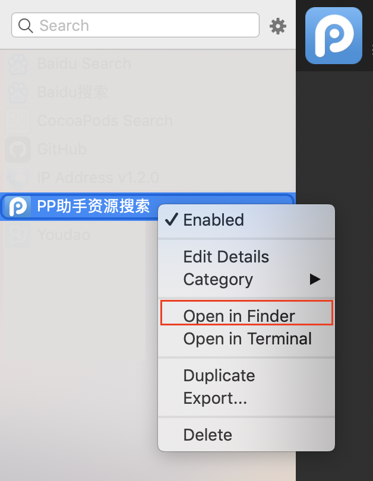

# PPSearch

An alfred workflow to search ipa resources in PPHelper online store.

## Usage

Double click *PPSearch.alfredworkflow* to import into Alfred 3.

Open Alfred, typein `pps {query}` to search jailbroken ipa.

* **General search: `pps {query}`**
* **Search Jailbroken IPA: `pjs {query}`**
* **Search App Store IPA: `pas {query}`**

All search can be flowed chars `--detial` or `-d` to show the first item detail infomation of the search result list.

**Extra Command: `ppc`** show extra command.

> All ipa's icon file will be cached in */~ppdownloader/* folder. And you can use command `ppc` to clean them.

## Source

After you imported into Alfred 3, you can get all source code in Alfred Perference.

